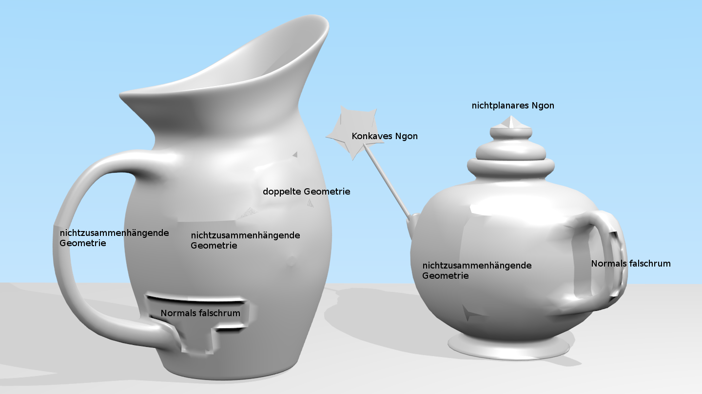
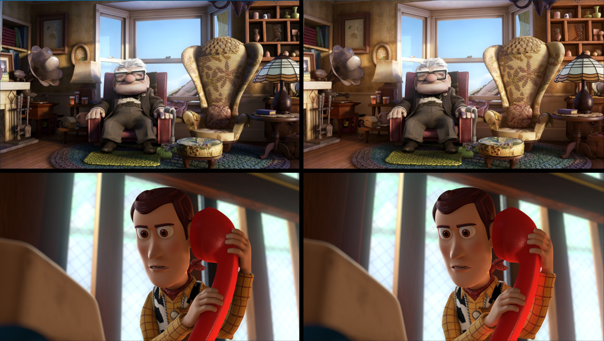
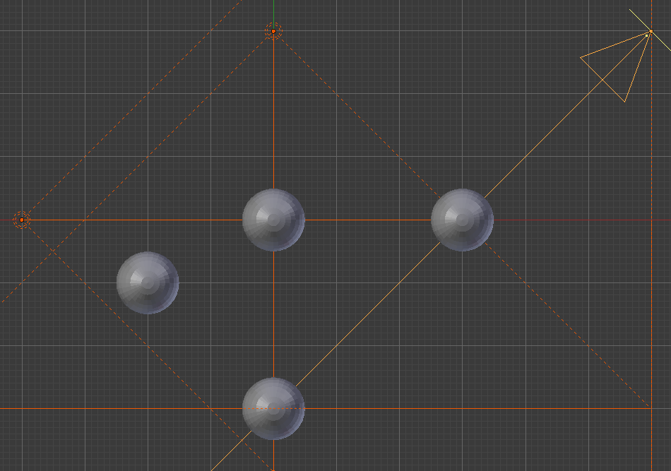

<script src="https://cdn.mathjax.org/mathjax/latest/MathJax.js?config=TeX-AMS-MML_HTMLorMML" type="text/javascript"></script>

# Modellieren und Animation Übungen

## Übung 2

### Aufgabe 1: Rendermethoden

**a)** Beschreiben Sie die beiden gängigen Rendermethoden

- **Rasterisierung**: Suche für jeden Pixel nach sichtbaren Dreiecken, Färbe den Pixel in der Farbe des vordersten Dreiecks ein. Renderaufwand steigt linear mit Pixelanzahl, sublinear mit Objektanzahl.
- **Raytracing**: Rückverfolg von Lichtstrahlen von der Kamera zur Lichtquelle. Renderaufwand steigt linear mit Objektanzahl, sublinear mit Pixelanzahl.

**b)** Vor- und Nachteile der Rendermethoden

|             |Raytracing|Rasterisierung|
|-------------|----------|--------------|
|Echtzeitfähig|          |X             |
|Spiegelung   |X         |              |
|Lichtbrechung|X         |              |
|Schatten     |X         |              |
|Fotorealismus|X         |              |

## Übung 4

### Aufgabe 1: Koordinatensystem

**a)** Welches Koordinatensystem verwendet Blender?

Blender verwendet ein rechtshändisches Koordinatensystem, bei dem die z-Achse die Höhe darstellt.

**b)** Welches Koordinatensystem verwendet Blender?

Cinema 4D verwendet ein linkshändisches Koordinatensystem, bei dem die y-Achse die Höhe darstellt.

**c)** In welche Richtung schaut die Kamera, wenn man sie zurücksetzt?

- Cinema 4D: Z-Richtung (horizontal)
- Blender: -Z-Richtung (unten)

### Aufgabe 2: Matrizen

**a)** Wie wird ein Polygon rotiert?

Das Polygon muss in den Ursprung versetzt, mit der Rotationsmatrix multipliziert, und wieder zurück verschoben werden.

**c)**

Verschiebung in den Ursprung:

M_1 = $$ \begin{pmatrix} 1 & 0 & 0 & -2 \\ 0 & 1 & 0 & -1 \\ 0 & 0 & 1 & 0 \\ 0 & 0 & 0 & 1 \end{pmatrix} $$

Rotation um 90°:

M_2 = $$ \begin{pmatrix} 0 & -1 & 0 & 0 \\ 1 & 0 & 0 & 0 \\ 0 & 0 & 1 & 0 \\ 0 & 0 & 0 & 1 \end{pmatrix} $$

Verschiebung zur ursprünglichen Position:

M_3 = $$ \begin{pmatrix} 1 & 0 & 0 & 0 \\ 0 & 1 & 0 & 0 \\ 0 & 0 & 1 & 0 \\ 2 & 1 & 0 & 1 \end{pmatrix} $$


Multiplikation der Matrizen:

M_2 * M_1:

M_{21} = $$ \begin{pmatrix} 0 & -1 & 0 & 1 \\ 1 & 0 & 0 & -2 \\ 0 & 0 & 1 & 0 \\ 0 & 0 & 0 & 1 \end{pmatrix} $$

M_3 * M_{21}:

M_{321} = $$ \begin{pmatrix} 0 & -1 & 0 & 3 \\ 1 & 0 & 0 & -1 \\ 0 & 0 & 1 & 0 \\ 0 & 0 & 0 & 1 \end{pmatrix} $$

$$ \implies $$ Dann die alten Punkte mit der Matrix multiplizieren.

## Übung 5

### Aufgabe 1

**a)**

Modifier verändern das Mesh nicht

**b)**

Wenn man den Sub-Surf Modifier anwenden würde, wäre es später sehr viel schwieriger das Mesh nochmals zu verändern

Wenn man etwas animieren möchte, ist es leichter mit Modifiern zu arbeiten

### Aufgabe 2

Beschreiben sie die Modifier

**a) Array Modifier**

Erstellt ein Feld von Objekten

**b) Bevel Modifier**

rundet Kanten ab

**c) Boolean Modifier oder alternativ Knife Project**

kombiniert mehrere Objekte nach boolschen Funktionen

**d) Mirror Modifier**

spiegelt das Mesh

### Aufgabe 3: Modellierung mit Lattices

Lattices sind diese Käfige

## Übung 6

### Aufgabe 1: Modellierung mit Splines

Splines sind Pfade

### Aufgabe 2: View Space Transformations

### Aufgabe 3: Mesh-Qualität

**a)**



## Übung 7

### Aufgabe 1: Topologie und Geometrie

**a)**

Topologie:

beschreibt welche Punkte jeweils Flächen und Kanten definieren

Geometrie:

beschreibt wo die Punkte im Raum liegen

**b)**

- selbe Topologie, unterschiedliche Geometrie: Würfel und Quader
- beides unterschiedlich: Würfel und Raumschiff
- selbe Geometrie, unterschiedliche Topologie: Quadrat und gleiches Quadrat nur ohne Face, Lichtquelle

### Aufgabe 2: Normalenvektoren

**a)**

Berechnen sie die Normalenvektoren für $$F_{1}$$ und $$F_{2}$$

```  
geg: 	P1(1,-2,0)  P2(1,0,2)  P3(-1,0,2)  P4(-1,-2,0)  P5(1,2,0)  P6(-1,2,0)
	 	F1 = P1,P2,P3,P4   F2 = P2,P5,P6,P3

	--->   ( 0)   --->   (-2)         ->   --->   --->   (-2* 0 - -2* 0)   ( 0)     ( 0)
	P2P1 = (-2)   P2P3 = ( 0)	   a*n1 = P2P1 x P2P3 = (-2*-2 -  0* 0) = ( 4) = 4*( 1)
	       (-2)          ( 0)                            ( 0* 0 - -2*-2)   (-4)     (-1)

	--->   ( 0)   --->   (-2)         ->   --->   --->   (-2* 0 -  2* 0)   ( 0)     ( 0)
	P5P2 = (-2)   P5P6 = ( 0)	   b*n1 = P5P2 x P5P6 = ( 2*-2 -  0* 0) = (-4) = 4*(-1)
	       ( 2)          ( 0)                            ( 0* 0 - -2*-2)   (-4)     (-1)
```

**b)**

Geben sie die Vertexnormalen an den Punkten &&P_{1}$$ bis $$P_{6}$$ an

Für jeden Punkt werden die Normalenvektoren der anliegenden Faces addiert und der resultierende Vektor dann normiert.

### Aufgabe 3: LOD

**a)**

- Auflösung von gestreamten Videos
- selektive AI (Aggro Range)
- Level Unterteilung

**b)**

Je nachdem wie leistungsstark die Hardware ist, sind unterschiedliche Varianten sinnvoll.

Popping ist am performantesten, Alpha Fading sieht am besten aus.

## Übung 8

### Aufgabe 1:Modellierung mit NURBS

### Aufgabe 2: Lokale vs globale Beleuchtung

**a)**

Begründen sie anhand passender Stellen ob die Beleuchtung lokal oder globals ist



Beide: links ist lokale, rechts ist globale Beleuchtung

oben: Ecke oben links und Sessel sind heller

unten: Die Arme werden von dem Telefonhörer angeleuchtet

**b)**

kleine Lichtquellen mit genau dieser Farbe direkt vor das Objekt stellen

### Aufgabe 3: Lichtquellen

**b)**

für schwarze Löcher

für dunkle Höhlen

## Übung 9

### Aufgabe 1: Lichtquellen und Schatten

### Aufgabe 2: Shadow Mapping



**a)**

|ShadowMap|x , y|z|
|:-:|:-:|:-:|
|$$S_{1}$$|0 , 0|4|
||1 , 0|2|
||3 , 0|4|
|$$S_{2}$$|-2 , 0|4|
||0 , 0|3|
||3 , 0|3|

**b)**

Vorteil: Performance

Nachteil: keine physikalische Korrektheit

**c)**

in Blender heißt Shadow-Mapping "Buffer Shadow"

**d)**

weil die z-Werte nur bei Spotlights nicht negativ werden können

## Übung 10

### Aufgabe 1: Interpolative Schattierungsverfahren

**a)**

Phong, da es rund erscheint (-> bei Phong wird zwischen den Vertexnormalen interpoliert)

## Übung 12

### Aufgabe 1: Texture Mapping - Bilineares Filtering

Angabe:

T(0,0)=(1,0,0)

T(1,0)=(0,0,0)

T(0,1)=(1,0,0)

T(1,1)=(1,1,1)

Welchen Farbwert erhalten wir an der Stelle T($$\frac{1}{2},\frac{2}{3}$$) wenn wir mit bilinearer Interpolation filtern?

- rot:  (1+0+1+1)/4 = $$\frac{3}{4}$$
- grün: (0+0+0+1)/4 = $$\frac{1}{4}$$
- blau: (0+0+0+1)/4 = $$\frac{1}{4}$$

=> T($$\frac{1}{2},\frac{2}{3}$$) = ($$\frac{3}{4},\frac{1}{4},\frac{1}{4}$$)

### Aufgabe 2: Environment Mapping

**a)**

2

### Aufgabe 3: Bump Mapping

**a)**

Es geht Information der Bump-Map verloren, da nur immer die Normalenvektoren der Vertices der Fläche berechnet und dann interpoliert werden.

**b)**

gar nicht

## Übung 13

### Aufgabe 1: Pfadanimation

### Aufgabe 2: Kamera-Animation

### Aufgabe 3: Animation nichtgeometrischer Parameter

### Aufgabe 4: Soft Body Animation
